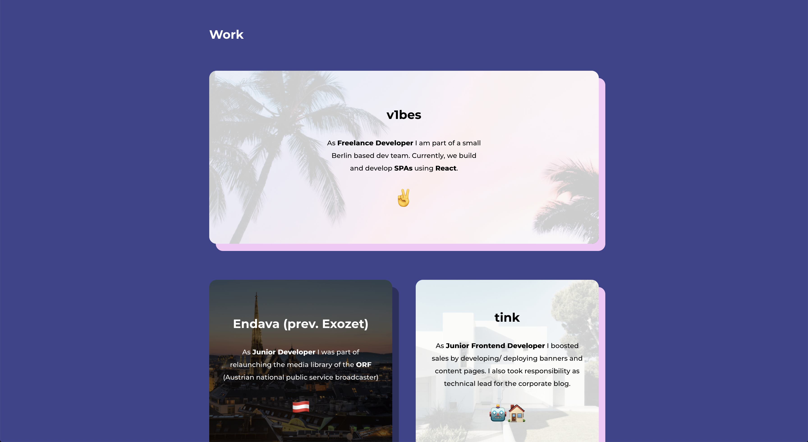

# vincent21

[](https://github.com/vincentrohde/vincent21/actions/workflows/deploy.yml)
[](https://github.com/vincentrohde/vincent21/actions/workflows/eslint.yml)


The 2021 version of my personal portfolio page. Built with Next.js and Typescript 🚀

## Contents

1. [Installation](#installation)
2. [Features](#features)
    1. [Cards](#cards)
    2. [Blocks](#blocks)
    3. [Sections](#sections)

## Installation

Clone repository

```
git clone https://github.com/vincentrohde/vincent21.git
cd ./vincent21
```

Install dependencies

```
npm install
```

Now that you have everything in place you can start the project.

```
npm run dev
# or
yarn dev
```

The project will be available via

```
http://localhost:3000
```

## Features

### Cards

A lot of times content is displayed using cards. The basic ``Card`` component is used for almost anything on the page.

There are also more complex versions of the base, like the ``ShadowCard`` component, which extends the base with a ``ShadowBox`` component. It is used for every card that has a shadow behind the content.


_Desktop View of a ``SocialCard`` with some text next to it. It extends from the ``ShadowCard`` and includes an ``OverlayImage`` at the top._

### Blocks

Blocks represent a reusable collection of multiple components, that are always put together in the same way. An example would be the ``ProjectPreview`` block that is used to preview a project. Blocks are used in lists (ex. previewing multiple projects).


_Desktop View of a ``ProjectPreview`` block. It includes an ``ImageCard``, up to 3 ``Button`` components, a ``Text`` and finally ``Tags``._

### Sections

The page is divided into unique sections, such as the  ``Work`` section. They then act as static templates, that use blocks and components to display the information provided to them.



_Desktop View of the ``Work`` section, with a group of ``WorkPreview`` blocks._
